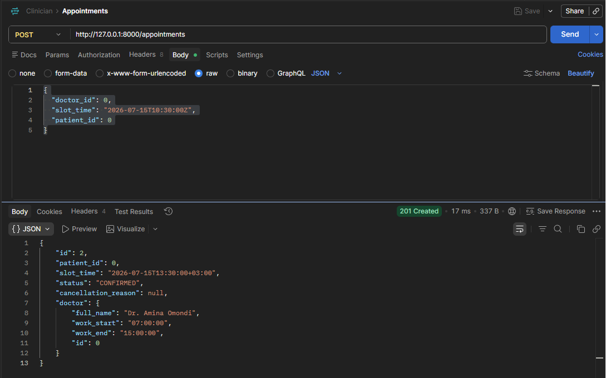
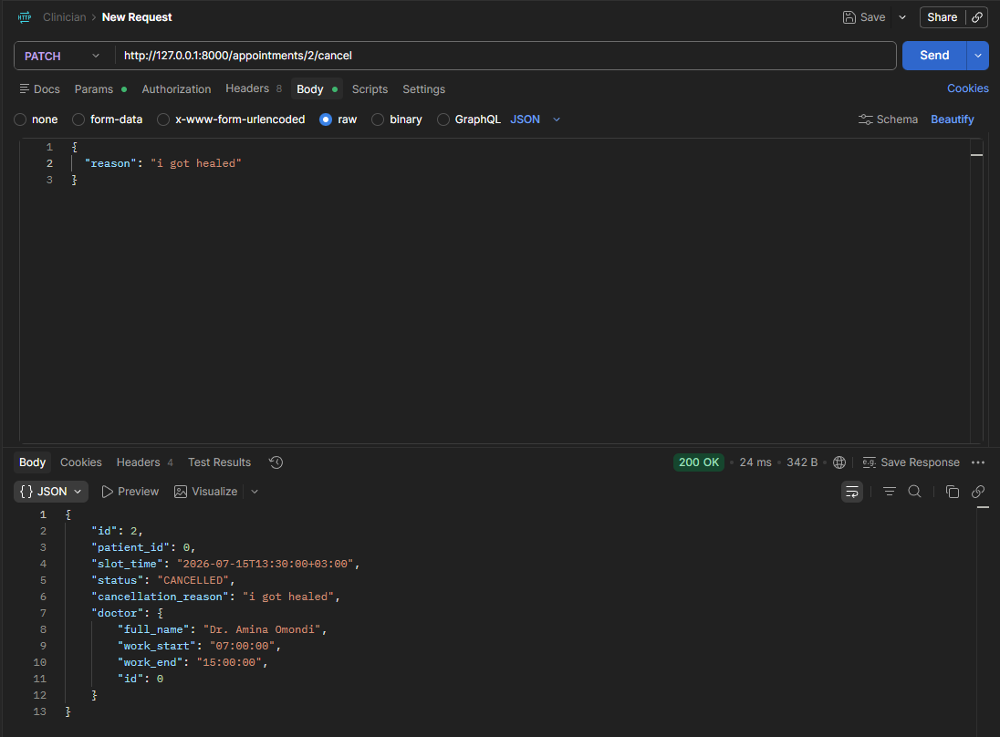
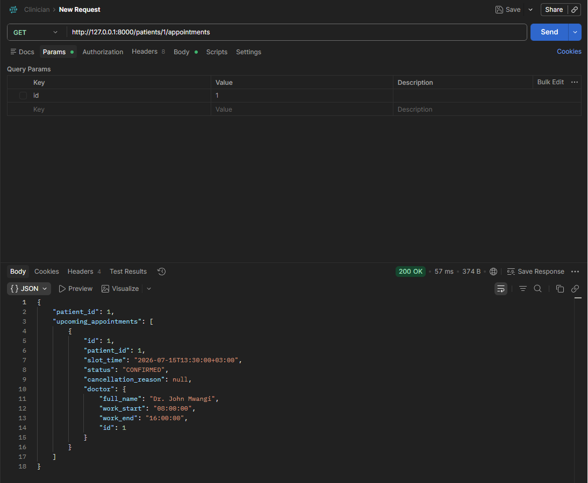

# Clinic Appointment Booking System


A FastAPI and PostgreSQL service for discovering, booking, cancelling, and rescheduling doctor appointments. The system uses fixed 30-minute appointment slots and prioritizes data consistency, privacy, and protection against double-booking.

## Live Production Access
- **Production API:** https://clinic-backend-421781141134.europe-west3.run.app

- **Swagger Documentation:** https://clinic-backend-421781141134.europe-west3.run.app/docs

## Architecture

The application follows a simple monolithic layered design:

```text
Client (Postman)
  | HTTPS Request
  v
FastAPI Presentation Layer
  |- API Routers: Enforces HTTP request parsing and structural input validation
  |- Pydantic Schemas: Sanitizes data shapes and guarantees strict output security
  |
  v
Services Layer (Business Logic Engine)
  |- Implements scheduling rules, cut-off windows, and multi-step state checks
  |
  v
Data Access Layer (SQLAlchemy ORM)
  |- Executes explicit database queries, maps model classes, and manages transactions
  |
  v
PostgreSQL Database (Source of Truth)

PostgreSQL is the source of truth for appointment state. Appointment timestamps are stored as `TIMESTAMPTZ` and handled in UTC.

## Running the Project Locally

Follow these sequential steps to establish your local runtime workspace, compile dependencies, configure your local database instance, and execute the service.

## Features

- View doctor availability
- Book appointments
- Cancel appointments
- Reschedule appointments
- Prevent double booking
- Enforce one-hour booking cutoff
- Real-time slot availability
- Transaction-safe scheduling
- PostgreSQL-backed persistence
- REST API with OpenAPI documentation

# Technologies Used

- Git
- GitHub
- GitHub Actions
- Docker
- FastAPI
- GCP
- PostgreSQL

---

## Running the Project Locally

Follow these sequential steps to establish your local runtime workspace, compile dependencies, configure your local database instance, and execute the service.

### Prerequisites
Ensure your machine has the following foundational system components installed:
*   **Python:** Version `3.11` or newer.
*   **PostgreSQL Engine:** Version `14` or newer, actively running and accepting local connections.

---

## Clone the repository

```bash
git clone https://github.com/njange/Clinician.git
```

## Navigate into the project

```bash
cd Clinician
```

## Create a virtual environment

```bash
python -m venv venv
```

## Activate the virtual environment

**Linux/macOS**

```bash
source venv/bin/activate
```

**Windows (PowerShell)**

```powershell
.\venv\Scripts\Activate.ps1
```

## Install dependencies

```bash
pip install --upgrade pip
pip install -r requirements.txt
```

## Deployment

### Deployment Branch

The application is deployed automatically from the **main** branch.

### Deployment Process

Whenever changes are pushed or merged into the `main` branch:

1. GitHub Actions is triggered.
2. Dependencies are installed.
3. The application is built.
4. Automated tests are executed.
5. If all checks pass, the application is deployed to the GCP.

---

## CI/CD Pipeline

The pipeline automates the software delivery process by:

- Checking out the repository.
- Installing project dependencies.
- Running linting checks.
- Running automated tests.
- Building the application.
- Deploying the latest successful build.
- Preventing deployments when tests fail.

This ensures every deployment is based on verified, production-ready code.

---

## API Endpoints

| Method | Path | Purpose |
| --- | --- | --- |
| `GET` | `/doctors/{id}/availability?date=YYYY-MM-DD` | List unbooked 30-minute slots during the doctor's working hours. |
| `POST` | `/appointments` | Create an appointment for an available slot. |
| `PATCH` | `/appointments/{id}/cancel` | Cancel an appointment; a cancellation reason is required. |
| `PATCH` | `/appointments/{id}/reschedule` | Atomically move an appointment to a new eligible slot. |
| `GET` | `/patients/{id}/appointments/upcoming` | Retrieve a patient's upcoming appointments. |
| `GET` | `/health` | Report service and database health. |


## 🧪 API Validation & Live Testing (Postman)

All API endpoints were validated against the live Cloud Run deployment using **Postman**. The tests verify the application's scheduling logic, transactional integrity, and business rules. To comply with data privacy requirements (including Kenya's ODPC guidelines), API responses exclude sensitive Personally Identifiable Information (PII) such as patient phone numbers and provider email addresses.

### 1. Doctor Availability (`GET /doctors/{id}/availability`)

**Purpose**

Returns all available 30-minute appointment slots for a doctor.

**Validation**

- Calculates available slots from the doctor's configured working hours.
- Excludes time slots that already have active appointments.
- Updates availability in real time after bookings or cancellations.


---

### 2. Book Appointment (`POST /appointments`)

**Purpose**

Creates a new appointment if the requested slot satisfies all scheduling rules.

**Validation**

- Appointment must fall within the doctor's working hours.
- Time must align to a 30-minute interval.
- Slot must not already be booked.
- Appointment must be at least one hour in the future.
- Returns **HTTP 201 Created** on success.



---

### 3. Cancel Appointment (`PATCH /appointments/{id}/cancel`)

**Purpose**

Cancels an existing appointment and immediately releases the slot for future bookings.

**Validation**

- Requires a valid `cancellation_reason`.
- Changes appointment status to `CANCELLED`.
- Makes the slot immediately available again.
- Prevents duplicate cancellations by returning **HTTP 400 Bad Request** for already cancelled appointments.



---

### 4. Reschedule Appointment (`PATCH /appointments/{id}/reschedule`)

**Purpose**

Moves an appointment to a different available time slot.

**Validation**

- Executes within a database transaction to ensure atomicity.
- Locks the appointment record during the operation (`SELECT ... FOR UPDATE`).
- Validates the new slot using the same rules as appointment creation.
- Releases the original slot only after the new booking succeeds.
- Rejects requests for appointments that have already been cancelled.


---

### 5. Upcoming Patient Appointments (`GET /patients/{id}/appointments/upcoming`)

**Purpose**

Retrieves all future appointments for a patient.

**Validation**

- Returns appointments scheduled on or after the current UTC time.
- Orders results chronologically (earliest first).
- Returns only appointments belonging to the requested patient.



---

### Summary

The API testing confirms that the application correctly enforces:

- Dynamic doctor availability
- Prevention of double bookings
- Working-hour scheduling constraints
- 30-minute appointment intervals
- One-hour advance booking requirement
- Transaction-safe appointment rescheduling
- Immediate slot recovery after cancellation
- Chronological retrieval of upcoming appointments
- Privacy-conscious API responses that exclude sensitive PII


##  Error Validation & Structured Status Handling

The application maps engine anomalies to contextual HTTP status layers with clear, predictable error schemas:

| Threat Scenario | HTTP Status | Expected API Error Body Details |
| :--- | :--- | :--- |
| **Double Booking Race Condition** | `409 Conflict` | `"Value error, Appointment slot is already reserved."` *(Enforced by PostgreSQL unique index)* |
| **Short-Notice Scheduling** | `422 Unprocessable` | `"Value error, Appointment slot must be scheduled at least 1 hour in advance."` |
| **Past Datetime Payload** | `422 Unprocessable` | `"Value error, Appointment slot cannot be scheduled in the past."` |
| **Out of Bound Hours** | `400 Bad Request` | `"Requested slot time falls outside of the doctor's configured working hours."` |
| **Mutating a Cancelled Record** | `400 Bad Request` | `"Cannot reschedule/cancel an appointment that is already CANCELLED."` |

# AI Usage Documentation

## 1. What did you use AI for across the four sections?

AI was used as a development assistant throughout the project in the following ways:

### Planning

- Breaking down project requirements.
- Understanding the CI/CD workflow.
- Explaining GitHub Actions concepts.
- Generating implementation ideas and design.

### Development

- Debugging build and deployment issues.
- Explaining error messages.
- Assisting with GitHub Actions workflow configuration.

### Documentation

- Improving README formatting.
- Organizing setup instructions.

### Testing and Debugging

- Explaining failing test results.
- Suggesting possible fixes.
- Helping identify configuration mistakes.
- Recommending debugging steps.

---

## 2. One example where an AI suggestion improved the project

One useful AI suggestion was improving the GitHub Actions workflow by ensuring that automated tests run before deployment.

### Prompt used

> "Help me create a GitHub Actions workflow that installs dependencies, runs tests, builds the application, and deploys only if all steps succeed."

The generated workflow provided a strong starting point that reduced setup time and ensured deployments only occur after successful validation.

---

## 3. One example where AI was wrong or incomplete

AI initially suggested a deployment configuration that omitted some required environment variables for the hosting platform.

This resulted in deployment failures.

The issue was identified by:

- Reading the deployment logs.
- Comparing the suggested configuration with the hosting platform documentation.
- Updating the missing environment variables manually.

This demonstrated the importance of verifying AI-generated configurations instead of accepting them without testing.

---

## 4. Two decisions made without AI

### Decision 1

I decided on the repository structure and folder organization based on my understanding of the project requirements and standard development practices.

I trusted my own judgment because I wanted the structure to remain consistent with previous projects and easy to maintain.

### Decision 2

I chose the branching strategy by using the `main` branch as the deployment branch and creating feature branches for development.

I trusted my judgment because this follows common Git workflows and simplifies continuous deployment while keeping production code stable.

---

# Lessons Learned

During this project I learned:

- How GitHub Actions automates software delivery.
- The importance of automated testing before deployment.
- How continuous deployment reduces manual work.
- That AI is most effective as a development assistant rather than a replacement for testing and verification.
- The value of reading logs and official documentation when troubleshooting deployment issues.

---

# Future Improvements

Potential future enhancements include:

- Increased automated test coverage.
- Code quality analysis using static analysis tools.
- Security scanning in the CI pipeline.
- Preview deployments for pull requests.
- Performance monitoring after deployment.

---

## License

MIT License